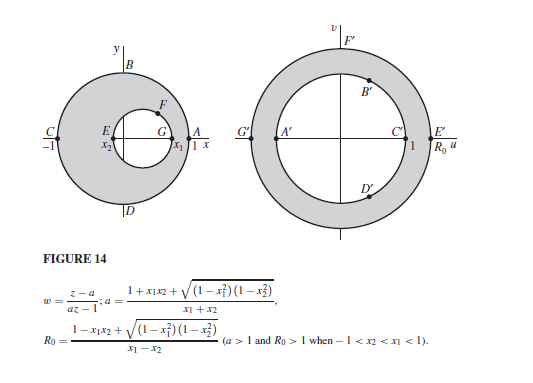

The following animation was constructed with the spirit of the visualization of complex functions illustrated in 3Blue1Brown's Riemann Hypothesis video. This animation highlights the conformal mapping of a specific linear transformation known as figure 14 in Ruel Churchill's Complex Analysis viewed below.

The following animation is the output of the code located in the ConformalMapping\media\videos\ConformalMapping\1080p60:

<source src="media\videos\ConformalMapping\1080p60\Figure14.mp4" type="video/mp4" width="1080">